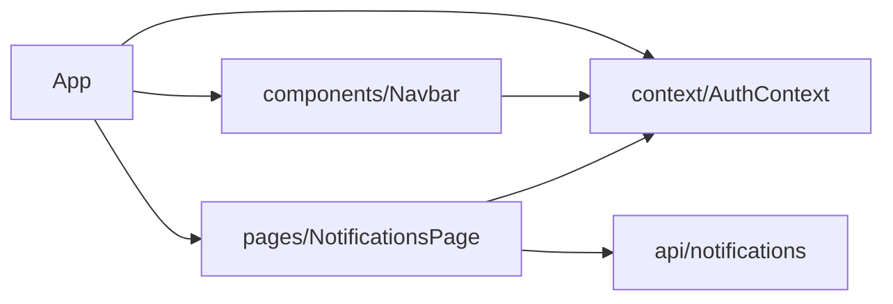

# Auditoría Frontend: Módulo de Notificaciones

## 1. Resumen ejecutivo
- **Arquitectura**: Página dedicada `NotificationsPage.jsx` que consume APIs desde `src/api/notifications.js`; sin hooks compartidos ni stores externos. Controla estado local (filtros, datos, mensajes) y se monta únicamente bajo permiso SUPERADMIN.
- **Cubrimiento funcional**: Lista paginada, filtros básicos, ACK individual y acción global `clear-resolved`. No hay polling/tiempo real ni URL sync.
- **Contrato backend**: Se consumen `/api/notifications`, `/api/notifications/{id}/ack`, `/api/notifications/clear-resolved`. Respuesta asumida sin tipado fuerte; se confía en datos tal como llegan.
- **Hallazgos clave**: Falta confirmación/dry-run en clear-resolved, ausencia de columnas para `ack_by/ack_at`, formateo de fecha dependiente del locale del navegador, filtros sin persistencia en la URL.

## 2. Inventario de rutas y páginas
| Ruta | Archivo origen | Descripción |
| --- | --- | --- |
| `/notifications` | `src/pages/NotificationsPage.jsx` | Página principal, protegida para SUPERADMIN, tabla de notificaciones. |
| `/audit` | `src/pages/AuditPage.jsx` | Referencia cruzada para auditoría (no detallada aquí). |

`src/App.jsx` registra `/notifications` y aplica guardas (`token`, `mustChangePassword`, `isSuperadmin`).

## 3. Componentes principales
| Componente | Archivo | Rol |
| --- | --- | --- |
| NotificationsPage | `src/pages/NotificationsPage.jsx` | Contiene filtros, fetch de datos, tabla y modal de discos. |
| Navbar | `src/components/Navbar.jsx` | Incluye enlace a `/notifications` solo si `isSuperadmin`. |
| API client | `src/api/notifications.js` | Define `listNotifications`, `ackNotification`, `clearResolved`. |

No hay subcomponentes especializados para filas o filtros; todo se maneja dentro de la página.

## 4. Estado y datos
- **Fuentes**: Estado React (`useState`) para filtros, datos, mensajes. Fetch con `axios` (instancia global `src/api/axios.js`).
- **Formato receptado**: El código asume `items` como array de objetos; no hay validación. `status`, `provider`, `metric` se convierten a mayúsculas al renderizar.
- **disks_json**: Se usa directamente como `Array.isArray(item.disks_json)` sin parsing adicional. Requiere que backend entregue lista (ya corregido en backend).
- **Fechas**: `formatDate` usa `new Date(value).toLocaleString()` → depende del locale del usuario, no normaliza TZ.
- **Errores**: `error` en estado local; se muestra banner rojo; sin toasts ni reintentos.
- **Empty**: Texto "Sin notificaciones" cuando no hay datos.
- **Querystring**: No hay sincronización con la URL (react-router), por lo que filtros se pierden al refrescar.

## 5. Acciones
- **ACK**: Botón por fila (solo `OPEN`). Tras éxito muestra mensaje genérico y dispara `fetchData()` completo.
- **Clear-resolved**: Botón global; siempre ejecuta `dry_run=false`. No hay confirmación ni vista previa; resultado se muestra como mensaje informativo.
- **Masivo**: No existe ACK en lote ni selección múltiple.

## 6. UI / UX
- **Tabla**: Cabeceras fijas; sin ordenamiento ni columnas dinámicas.
- **Badges**: Estados `OPEN`, `ACK`, otros (gris). Visual claro.
- **disks_json**: Modal "Ver discos" con listado simple (uso % y tamaño). No hay resumen en la tabla.
- **Formato**: Porcentajes con dos decimales (`Number(value).toFixed(2)`). Fechas sin estandarizar.
- **Accesibilidad**: Falta focus trap en modal, sin atributos aria. Inputs sin labels accesibles (use de `<label>` básico ok).

## 7. Tiempo real
- No hay polling, SSE ni WebSocket. Usuario debe pulsar "Actualizar" manualmente.

## 8. Seguridad / RBAC
- `NotificationsPage` y ruta en `App.jsx` verifican `isSuperadmin`. Si no, se muestra tarjeta de acceso denegado.
- Las llamadas axios heredan interceptor global que añade Bearer token.

## 9. Performance
- Renderiza todos los elementos directamente; sin memoización ni virtualización.
- Cada acción (ACK/clear) re-fetch completo de la tabla.
- Filtros re-renderizan tabla completa (aceptable dado tamaño actual).

## 10. Gaps vs contrato backend
| Item | Backend esperado | UI actual | Severidad | Comentario |
| --- | --- | --- | --- | --- |
| `status` uppercase | "OPEN"/"ACK"/"CLEARED" | Se muestra upper (render) | Baja | Consistente, depender de backend. |
| `disks_json` lista | Lista de dicts | Se usa como lista (sin fallback) | Media | Si backend devolviera string habría error; actualmente normalizado. |
| `ack_by` / `ack_at` | Presentes | No se muestran | Media | Información audit útil falta en UI. |
| `created_at`, `at` ISO | ISO UTC | `toLocaleString()` cliente | Media | Puede provocar confusión por timezone. |
| `correlation_id` | String | Se muestra literal | Baja | Podría formatearse/mejorar contexto. |
| `clear-resolved` dry run | N/A | Ejecuta `dry_run=false` siempre | Alta | Riesgo de limpiar sin confirmación; no se soporta modo prueba. |
| Querystring sincronizado | Soportado | No implementado | Alta | Dificulta deep-linking, compartir estado de filtros. |
| Manejo de errores | `detail` | Banner simple | Media | Falta toasts/unificación, sin reintentos. |

## 11. Recomendaciones y plan
### Fase corta (prioridad alta)
1. **Clear-resolved seguro**: Añadir confirmación y opción `dry_run=true` antes de ejecutar limpieza real. Mostrar resultado en modal/toast.
2. **Mostrar metadatos**: Agregar columnas/tooltip para `ack_by`, `ack_at`, `created_at` con formateo UTC controlado (`Intl.DateTimeFormat` con opciones).
3. **Sincronizar filtros con URL**: Usar `useSearchParams` o helper para persistir `status`, `provider`, `metric`, `vm`, `env`, `from`, `to`, `limit`, `offset` en querystring.

### Fase media
4. **Feedback y errores**: Integrar sistema de notificaciones/toasts para ACK y clear (éxito/error). Considerar `react-hot-toast` o similar ya usado.
5. **Resumen de discos**: Mostrar "min/max uso" en la tabla, manteniendo modal para detalle.
6. **Optimización refetch**: Tras ACK, actualizar solo la fila o paginar refresco en lugar del fetch completo.

### Fase avanzada
7. **Tiempo real**: Evaluar polling o SSE para mantener tabla en sync (especialmente OPEN).
8. **UX mejorada**: ACK múltiple, filtros guardados en local storage, badges en Navbar con conteo OPEN.
9. **Accesibilidad**: Focus trap y aria labels en modal, revisar contraste en badges.

---

## Árbol de archivos relevantes
```text
frontend/src/
├─ App.jsx (routing, guardas, usa NotificationsPage)
├─ api/
│  └─ notifications.js (GET list, POST ack, POST clear)
├─ components/
│  └─ Navbar.jsx (link a /notifications solo SUPERADMIN)
└─ pages/
   └─ NotificationsPage.jsx (filtros, tabla, modal, acciones)
```

## Mapa de dependencias


## Priorización de brechas (resumen)
1. Clear-resolved sin confirmación/dry-run (Alta).
2. Metadatos clave ocultos (`ack_by`, `ack_at`, `created_at`) + formato fecha (Media/Alta).
3. Falta de querystring sync (Alta).
4. Manejo de errores y feedback uniforme (Media).
5. Mejores prácticas de rendimiento/accesibilidad (Media/Baja).

```
